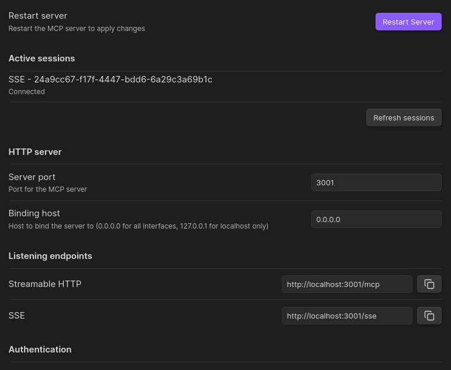

# Obsidian MCP Plugin

<div align="center">

[](LICENSE)
[](https://github.com/jlevere/obsidian-mcp-plugin/releases)
[](https://github.com/jlevere/obsidian-mcp-plugin/releases)

This Obsidian plugin embeds an MCP (Model Context Protocol) server directly within Obsidian, providing a streamlined
way for applications to interact with your vault.

[Installation](#installation) •
[Features](#features) •
[Usage](#usage) •
[Development](#development) •
[Schema Guide](#schema-guide)



</div>

## Features

- **Direct MCP Server:** Hosts the MCP server within Obsidian itself, simplifying setup and improving performance
- **Vault Access via MCP:** Exposes your vault through standardized tools
- **Structured Data Support:** Define custom schemas for structured note creation and validation
- **File Operations:**
  - Read and write files with smart diffing
  - Fuzzy search across your vault
  - Navigate vault structure programmatically
- **Configurable:** Customize server settings and tool availability


## Installation

### Community Plugins (Recommended)

1. Open Obsidian Settings > Community Plugins
2. Search for "MCP Plugin"
3. Click Install, then Enable
4. Configure settings as needed

### Manual Installation

1. Download the latest release zip
2. Extract to `<vault>/.obsidian/plugins/`
3. Enable in Obsidian settings

## Usage

### Basic Setup

1. Enable the plugin
2. Configure port and host in settings
3. Restart the plugin to apply changes

### Available Tools

- `read-file`: Get file contents
- `diff-edit-file`: Smart file updates
- `fuzzy-search`: Search vault contents
- `vault-tree`: Browse vault structure
- `upsert-file`: Create or update files

## Development

### Prerequisites

- Node.js >= 22.14.0
- pnpm >= 10.8.0
- Basic knowledge of TypeScript and Obsidian API

### Setup Development Environment

```bash

# Clone the repository

git clone https://github.com/yourusername/obsidian-mcp-plugin.git
cd obsidian-mcp-plugin

# Install dependencies

pnpm install

# Start development build

pnpm run dev
```

### Project Structure

- `src/`: Source code
  - `managers/`: Core functionality managers
  - `structured-tools/`: Schema validation and tools
  - `utils/`: Helper utilities
  - `vault/`: Vault interaction code
- `tests/`: Test files

### Building

```bash

# Production build

pnpm run build

# Run tests

pnpm test

# Package for distribution

pnpm run package
```

## Schema Guide

The plugin supports structured data through JSON Schema-based definitions. This enables type-safe note creation and validation.

### Creating a Schema

Create a new markdown file in your schema directory (default: `metadata/schemas`) with a YAML schema block:

##

```yaml
metadata:
  schemaName: "Recipe"
  description: |
    Updates a recipe file given a schema and identifiers. Creates the file if it doesn't exist.
    Uses the Recipe Schema. It merges new non-default data into existing frontmatter.
  identifierField: "recipe_id"
  pathTemplate: "Recipes/${category}/${recipe_id}/Recipe.md"
  pathComponents:
    - category
    - recipe_id

fields:
  recipe_id:
    type: "string"
    description: "Unique identifier for the recipe (e.g., `chocolate_chip_cookies`)."
    optional: false

  category:
    type: "string"
    description: "Recipe category for organizing files (e.g., `Desserts`)."
    optional: false

  title:
    type: "string"
    description: "Name of the recipe (e.g., `Chocolate Chip Cookies`)."
    optional: true

  description:
    type: "string"
    description: "Brief description of the recipe and its highlights."
    optional: true

  servings:
    type: "number"
    description: "Number of servings the recipe yields (must be at least 1)."
    optional: true
    minimum: 1
    maximum: 100
    default: 4

  ingredients:
    type: "array"
    description: "List of ingredients required for the recipe."
    optional: true
    items:
      type: "object"
      properties:
        name:
          type: "string"
          description: "The name of the ingredient (e.g., `all-purpose flour`)."
          optional: false
        quantity:
          type: "string"
          description: "Amount needed (e.g., `2 cups`, `1 tsp`)."
          optional: true

---
```

This generates an MCP tool that looks like this:


When you use it to put data into obsidan the result looks like this:


### Schema Validation

Schemas are validated against:

1. JSON Schema specification (draft-07)
2. Plugin's [meta-schema](./src/structured-tools/meta-schema.json) for additional requirements

### Supported Field Types

- `string`: Text values
- `number`: Numeric values
- `boolean`: True/false values
- `date`: Date values
- `array`: Lists of items
- `object`: Nested objects
- `enum`: Predefined options

### Using Schemas

Schemas can be used through:

1. MCP tools for programmatic note creation
2. Template suggestions in Obsidian
3. Validation of existing notes

## Contributing

1. Fork the repository
2. Create a feature branch
3. Commit your changes
4. Push to the branch
5. Open a Pull Request

## Credits

- Based on [obsidian-local-rest-api](https://github.com/coddingtonbear/obsidian-local-rest-api) by [coddingtonbear](https://github.com/coddingtonbear)
- Uses [Model Context Protocol](https://github.com/modelcontextprotocol/protocol) for AI interactions

## License

This project is licensed under the MIT License - see the [LICENSE](LICENSE) file for details.
