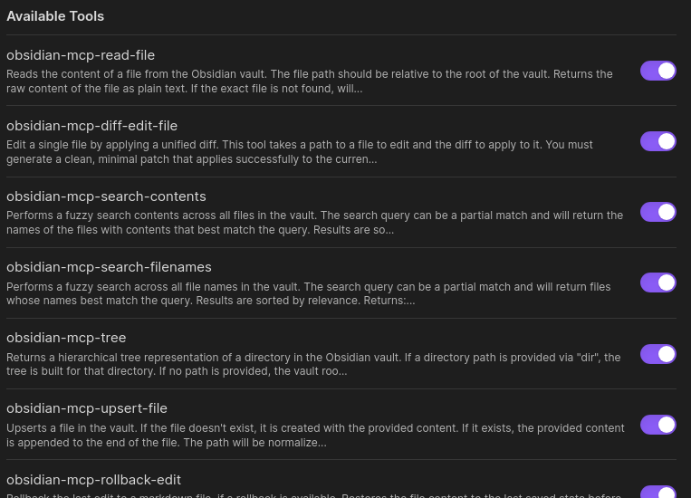
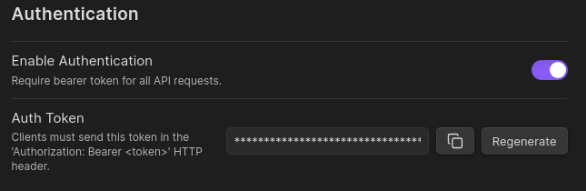

# Vault MCP

<div align="center">

## UNDER ACTIVE DEVELOPMENT

[](https://github.com/jlevere/obsidian-mcp-plugin/actions/workflows/test.yml)
[](https://github.com/jlevere/obsidian-mcp-plugin/releases)
[](https://github.com/jlevere/obsidian-mcp-plugin/releases)

This Obsidian plugin embeds an MCP server directly within Obsidian, providing a streamlined
way for applications to interact with your vault.

[Installation](#installation) •
[Features](#features) •
[Usage](#usage) •
[Development](#development) •
[Schema Guide](#schemas)


</div>

## Features

- **Embeded MCP Server:** Hosts the MCP server within Obsidian itself as a plugin, simplifying setup and improving performance
- **Vault Access via MCP:** Exposes your vault through standardized tools
- **Structured Data Support:** Define custom schemas for structured note creation and validation
- **File Operations:**
  - Read and write files
  - Fuzzy search across your vault
  - Navigate vault structure programmatically
  - Structured data storage and access
- **Configurable:** Customize server settings, tool availability, and authentication
- **Optional Authentication:** Secure your server with optional Bearer token authentication.





## Installation

### Community Plugins (Recommended)

1. Open Obsidian Settings > Community Plugins
2. Search for "Vault MCP"
3. Click Install, then Enable
4. Configure settings as needed

### Manual Installation

1. Download the latest release zip
2. Extract to `<vault>/.obsidian/plugins/`
3. Enable in Obsidian settings

## Usage

### Basic Setup

1. Enable the plugin in Obsidian's Community Plugins section
2. Open plugin settings to configure:
  - **Server Port** (default: `3000`)
  - **Binding Host** (default: 127.0.0.1; use 0.0.0.0 for LAN access)
3. **(Optional) Enable Authentication:**
   - Toggle **Enable Authentication**
   - Copy the provided **Auth Token**
   - Include the token in HTTP headers: `Authorization: Bearer <your_token>`
4. Click Restart Server to apply changes

### Connection Methods

The plugin currently only supports Server-Sent Events (SSE) and StreamHTTP connections. For applications that require stdio connections (like Claude Desktop), you'll need to use a proxy. You can follow [Cloudflare's guide](https://developers.cloudflare.com/agents/guides/test-remote-mcp-server/#connect-your-remote-mcp-server-to-claude-desktop-via-a-local-proxy) on setting up a local proxy using [`mcp-remote`](https://www.npmjs.com/package/mcp-remote).

Here is an example claude_desktop_config.json to use `mcp-remote` local proxy.

```json
{
  "mcpServers": {
    "obsidian": {
      "command": "npx",
      "args": ["mcp-remote", "http://localhost:<your_server_port>/sse"]
    }
  }
}
```

You can find the correct url from the plugin's setting pannel under endpoints.

### Available Tools

- `obsidian-mcp-read-file`: Get file contents
- `obsidian-mcp-diff-edit-file`: Edit files using simplified udiff (see [below](#obsidian-mcp-diff-edit-file))
- `obsidian-mcp-search-contents`: Fuzzy search across the contents of all files in your vault
- `obsidian-mcp-search-filenames`: Fuzzy search across all file names in your vault
- `obsidian-mcp-vault-tree`: Browse vault structure
- `obsidian-mcp-upsert-file`: Create or update files
- `obsidian-mcp-rollback-edit`: Roll back the last edit to a markdown file (reverts the last change made by supported tools)

# Highlighed tools

#### `obsidian-mcp-diff-edit-file`

This tool edits a single file by applying a simplified udiff. This is basically how Cursor and other LLM based code editors work. It is best for smarter models, as smaller ones tend to struggle to create the diffs acruately. To help with this problem, the tool returns a diff of the actual changes applied to the file. This helps the model to know that what got changed was what it expected or not.

An example of this simplified udiff format is as follows:

```diff
--- example.md
+++ example.md
@@ ... @@
-Old line of text
+New line of text
```

This simplified diff system is borrowed heavily from Aider, you can read more about their work [here](https://aider.chat/2023/12/21/unified-diffs.html)

#### `obsidian-mcp-rollback-edit`

This tool allows you to revert the last change made to a markdown file by supported file-writing tools (`obsidian-mcp-diff-edit-file`, `obsidian-mcp-upsert-file`, or structured update tools). Before any of these tools modify a file, the previous content is saved in a rollback store. You can use `obsidian-mcp-rollback-edit` to restore the file to its previous state.

If a rollback is available, the file will be restored to its previous content, and you'll get a message with the timestamp and reason for the last change. If not, you'll get an error message.

## Structured Data Edits (dynamic tools)

Create and update structured content in a typesafe manner using tool.

tl:dr
  LLMs are unreliable at directly editing structured formats like JSON or YAML. They break formatting or forget fields. Instead, Vault MCP defines a schema for your data and exposes it as a tool. The model then edits the structure via tool calls.

If you want to write a schema go here: [Write Your Own Schemas](#writing-your-own-schemas)

### How it works

LLMs are just bad at working with structured data. They break formatting, inject their own formatting, forget things, etc.

Vault MCP takes a somewhat novel approach to dealing with structured data, it creates a tool that the LLM can call to make updates to a data structure.

When the LLM wants to edit the structured data, it makes a tool call where the paramiters of the tool call corrispond to the fields of the data structure.

Most "good" models are trained specifically to make tool calls so this is a much more stable system.

This mapping of the structured data to the tool is done in a few steps
1. You define a schema using JSON Schema (draft-07), written in YAML.
2. Vault MCP validates it using a built-in [metaschema](#meta-schema)
3. The schema is converted to a [zod](https://github.com/colinhacks/zod)
3. A tool is dynamically created from that schema


### Schemas

Each schema has two sections:
1. `metadata`
  Defines file naming and storage details
2. `fields`
  Defines the structure of your data (used to generate the Zod tool)

The schemas are json schema draft 07, but witten in yaml for better usability. To be able to do this dynamic tool generation, the plugin needs to know both the structure of the structured data, but also some metadata about file names, locations etc.

#### User Schemas

<details>
  <summary>Here is an example of a user defined schema for storing recipes</summary>
  
```yaml
metadata:
  schemaName: "Recipe"
  description: |
    Updates a recipe file given a schema and identifiers. Creates the file if it doesn't exist.
    Uses the Recipe Schema. It merges new non-default data into existing frontmatter.
  identifierField: "recipe_id"
  pathTemplate: "Recipes/${category}/${recipe_id}/Recipe.md"
  pathComponents:
    - category
    - recipe_id

fields:
  recipe_id:
    type: "string"
    description: "Unique identifier for the recipe (e.g., `chocolate_chip_cookies`)."
    optional: false

  category:
    type: "string"
    description: "Recipe category for organizing files (e.g., `Desserts`)."
    optional: false

  title:
    type: "string"
    description: "Name of the recipe (e.g., `Chocolate Chip Cookies`)."
    optional: true

  description:
    type: "string"
    description: "Brief description of the recipe and its highlights."
    optional: true

  servings:
    type: "number"
    description: "Number of servings the recipe yields (must be at least 1)."
    optional: true
    minimum: 1
    maximum: 100
    default: 4

  ingredients:
    type: "array"
    description: "List of ingredients required for the recipe."
    optional: true
    items:
      type: "object"
      properties:
        name:
          type: "string"
          description: "The name of the ingredient (e.g., `all-purpose flour`)."
          optional: false
        quantity:
          type: "string"
          description: "Amount needed (e.g., `2 cups`, `1 tsp`)."
          optional: true

          
---
```

This generates an MCP tool that looks like this:


When you use it to put data into obsidan the result looks like this:


</details>


#### Meta Schema


To validate that the user defined schema contains the required components we have a meta schema defined in json schema. [You can read the file here](./src/structured-tools/meta-schema.json)

It also helps narrow the types to something that can be converted into zod more clearly.

You can use it to see a list of types and modifiers you can use such as `default` values, `minimum` and `maximum` etc.

<details>
  <summary>Here is the yaml version of the meta schema</summary>

```yaml
"$schema": http://json-schema.org/draft-07/schema#
title: MCP Structured Document Schema (JSON Schema Valid)
description: Strict meta-schema for structured tools using zod compatible fields.
type: object
required:
  - metadata
  - fields
properties:
metadata:
  type: object
  required:
    - schemaName
    - description
    - identifierField
    - pathTemplate
    - pathComponents
  properties:
    schemaName:
      type: string
    description:
      type: string
    identifierField:
      type: string
    pathTemplate:
      type: string
    pathComponents:
      type: array
      items:
        type: string
  additionalProperties: false
fields:
  type: object
  patternProperties:
    "^[a-zA-Z_][a-zA-Z0-9_]*$":
      type: object
      required:
        - type
      properties:
        type:
          type: string
          enum:
            - string
            - number
            - boolean
            - date
            - array
            - object
            - literal
            - unknown
            - any
        description:
          type: string
        default: {}
        minimum:
          type: number
        maximum:
          type: number
        enum:
          type: array
          items: {}
        items:
          type: object
        properties:
          type: object
        required:
          type: array
          items:
            type: string
      additionalProperties: true
  additionalProperties: false
additionalProperties: false
```

</details>

#### Writing your own schemas

Start by thinking about two things:

- `Where and how will the file be stored?`

Use metadata to describe filename templates and how to identify a file (e.g. by ID).

- `What structured data will be in the file?`

Use fields to define the structure using types like string, number, array, object, and modifiers like default, minimum, etc.

Once defined, your schema will automatically become a tool the LLM can use to update that file type.

Obsidian will render the YAML structure as a nicely formatted frontmatter or embedded block in your markdown.

When writing schemas, I found this tool particularly helpful [stefanterdell.github.io/json-schema-to-zod-react](https://stefanterdell.github.io/json-schema-to-zod-react/). Vault MCP uses this internally to generate the `zod` but this is a more visual method to help in troubleshooting.

## Development

### Prerequisites

- Basic knowledge of TypeScript and [Obsidian API](https://github.com/obsidianmd/obsidian-api)

A nix flake is provided to create a standarized development environment.

### Setup Development Environment

```bash

# Clone the repository

git clone https://github.com/yourusername/obsidian-mcp-plugin.git
cd obsidian-mcp-plugin

# Install dependencies

pnpm install

# Start development build

pnpm run dev
```

### Project Structure

- `src/`: Source code
  - `managers/`: Core functionality managers
  - `structured-tools/`: Schema validation and tools
  - `utils/`: Helper utilities
  - `vault/`: Vault interaction code
- `tests/`: Test files

### Building

```bash

# Production build

pnpm run build

# Run tests

pnpm test

# Package for distribution

pnpm run package
```

## Contributing

1. Fork the repository
2. Create a feature branch
3. Commit your changes
4. Push to the branch
5. Open a Pull Request

## Credits

- Inspired by [obsidian-local-rest-api](https://github.com/coddingtonbear/obsidian-local-rest-api) by [coddingtonbear](https://github.com/coddingtonbear)
- Uses [Model Context Protocol](https://github.com/modelcontextprotocol/protocol) for AI interactions

## License

This project is licensed under the MIT License - see the [LICENSE](LICENSE) file for details.
